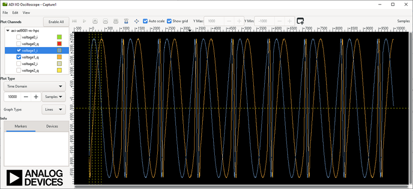

# libiio Examples - C Simple

The following set of examples provides some basic, simple use cases of leveraging
libiio in the C language along with the AD9081 evaluation board.  These intend
to not necessarily have a functional purpose, but rather demonstrate the libiio
library and IIO framework as a whole.

## hmc7044_attr_example
This example shows how to work with IIO attributes via the API in the different
data formats (strings, doubles and longlongs), as well as handling error
conditions. libiio also supports treating attributes as bools, however that
is not shown here.

Build: `gcc hmc7044_attr_example.c -liio -o hmc7044_attr_example`

Use and Expected Output:
```
analog@analog:~/iio_examples $ sudo ./hmc7044_attr_example
main, 78: INFO: CORE_TX Freq: 250000000 | 250000000.000000 | 250000000

main, 81: INFO: Setting 125000000.000000 via double..
main, 84: INFO: CORE_TX Freq: 125000000.000000

main, 87: INFO: Setting 62500000 via int..
main, 90: INFO: CORE_TX Freq: 62500000

main, 93: INFO: Setting 250000000 via string/raw..
main, 96: INFO: CORE_TX Freq: 250000000

main, 100: INFO: Invalid attribute names return: -2

main, 104: INFO: Invalid values return: -22
```

## ad9081_data_capture
This example shows how to continuously capture data from a receive buffer. In
this case, the Rx data path is set to the ramp test pattern for easily
identifiable data, and the data is simply written to a file.

Build: `gcc ad9081_data_capture.c -liio -o ad9081_data_capture`

Use and Expected Output:
```
analog@analog:~/iio_examples $ sudo ./ad9081_data_capture test.bin
main, 102: INFO: Starting Sampling
main, 112: INFO: Completed sampling
analog@analog:~/iio_examples $ hexdump test.bin | head
0000000 5752 17d2 5752 17d2 5753 17d3 5753 17d3
0000010 5754 17d4 5754 17d4 5755 17d5 5755 17d5
0000020 5756 17d6 5756 17d6 5757 17d7 5757 17d7
0000030 5758 17d8 5758 17d8 5759 17d9 5759 17d9
0000040 575a 17da 575a 17da 575b 17db 575b 17db
0000050 575c 17dc 575c 17dc 575d 17dd 575d 17dd
0000060 575e 17de 575e 17de 575f 17df 575f 17df
0000070 5760 17e0 5760 17e0 5761 17e1 5761 17e1
0000080 5762 17e2 5762 17e2 5763 17e3 5763 17e3
0000090 5764 17e4 5764 17e4 5765 17e5 5765 17e5
analog@analog:~/iio_examples $
```

## ad9081_data_tx
This example shows how to transmit a cyclic buffer via libiio C code. In this
case, the data is a simple single tone that alternates frequency on each cycle.

Build: `gcc ad9081_data_tx.c -liio -lm -o ad9081_data_tx`

Expected Output:

