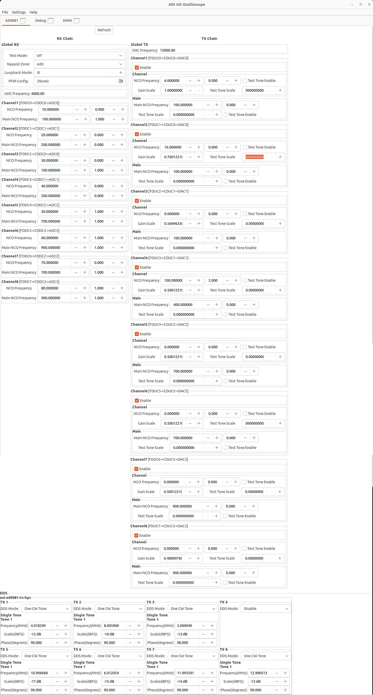

# libiio Example - Full Setup C

The following example shows configuring all attributes of the AD9081 based on
the desired configuration found using the IIO Scope GUI tool.

The goal of this example is to give context to the actions IIO Scope takes in
configuration, and how to translate those parameters programmatically to C.

## Building
To build this application, simply run GCC while linking against libiio and
libmath:

`gcc ad9081_fullsetup.c -liio -lm -o ad9081_fullsetup`

*NOTE:*This application attempts to configure 8 pairs of I&Q for each Rx and Tx
data path.  The default HDL and device tree configuration in Kuiper Linux (m8_l4)
only has 4 pairs in each direction.  The NUM_CH constant can be redefined at
build time to only support the first 4 channels:

`gcc ad9081_fullsetup.c -liio -lm -DNUM_CH=4 -o ad9081_fullsetup_4ch`

## Goal Configuration
The following screen capture shows the goal configuration to be obtained:

